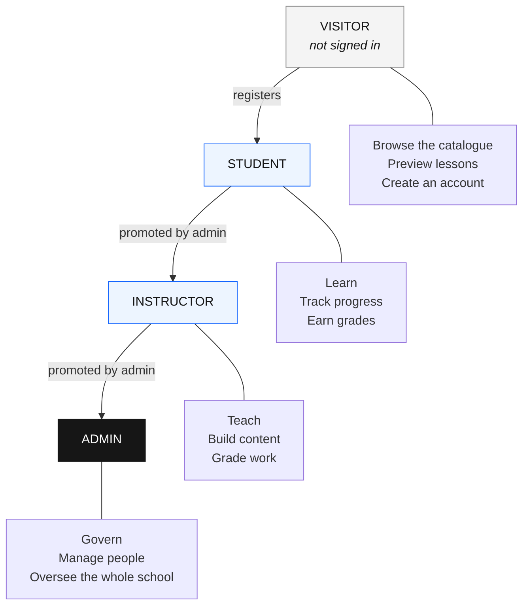
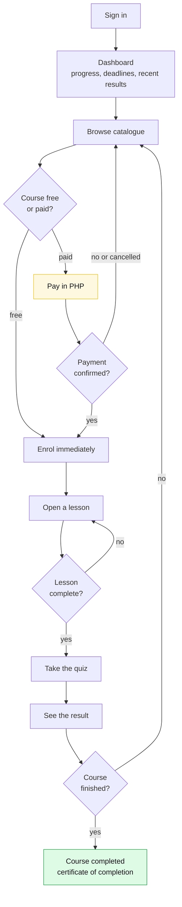
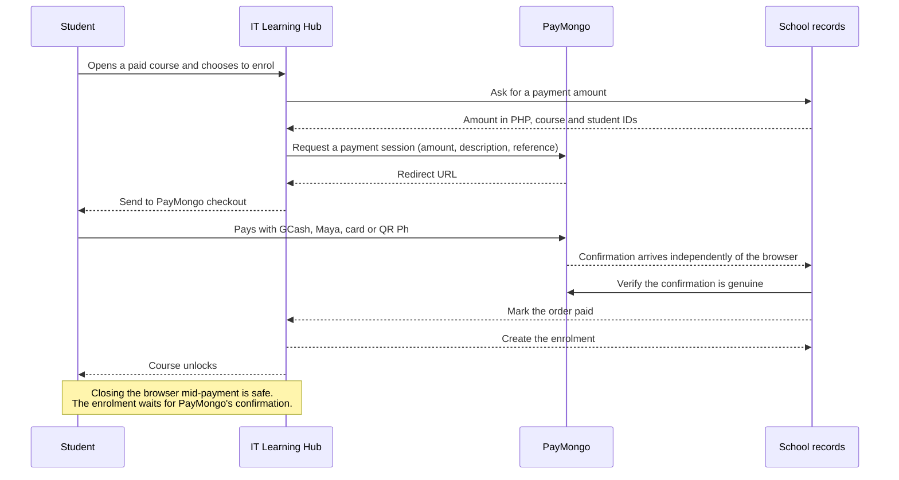

# IT Learning Hub — User Role Flowchart

How the four user roles move through the LMS and what each one can reach.
This document is business-level: it describes access and journeys, not
implementation.

---

## 1. The four roles at a glance

A visitor is not a stored role. It is simply the state of someone who has not
signed in, so there is nothing to assign, revoke or audit.

---

## 2. Access boundaries

The single most important rule in the system: **a role only ever sees its own
world.** This is enforced by the database itself, not by the menus.

```mermaid
flowchart LR
    subgraph VISITOR["Visitor"]
        V1["Catalogue"]
        V2["Course preview"]
        V3["Sign in / Register"]
    end

    subgraph STUDENT["Student"]
        S1["My courses"]
        S2["Lessons and materials"]
        S3["Quizzes"]
        S4["Assignments"]
        S5["Grades"]
        S6["Calendar and alerts"]
        S7["My profile"]
    end

    subgraph INSTRUCTOR["Instructor"]
        I1["My courses"]
        I2["Modules and lessons"]
        I3["Quizzes and questions"]
        I4["Assignments"]
        I5["My students"]
        I6["Grading"]
        I7["Announcements"]
        I8["Course insights"]
    end

    subgraph ADMIN["Admin"]
        A1["People and roles"]
        A2["Course catalogue"]
        A3["Categories"]
        A4["Payments"]
        A5["School-wide reports"]
        A6["Announcements"]
        A7["System settings"]
    end

    VISITOR -->|"registers"| STUDENT
    STUDENT -->|"promoted"| INSTRUCTOR
    INSTRUCTOR -->|"promoted"| ADMIN

    style VISITOR fill:#f4f4f4,stroke:#8d8d8d,color:#161616
    style STUDENT fill:#ffffff,stroke:#0f62fe,color:#161616
    style INSTRUCTOR fill:#ffffff,stroke:#0f62fe,color:#161616
    style ADMIN fill:#ffffff,stroke:#161616,color:#161616
```

**Cross-boundary leakage is the failure this design exists to prevent.** A
student must not read another student's grades. An instructor must not touch
another instructor's courses. Only an admin sees across the whole school.

---

## 3. Visitor

Someone who has arrived but not signed in.

**Can do**
- Browse every published course in the catalogue
- Open a course page and read its description, lessons and materials list
- Watch free preview lessons marked by the instructor
- Create an account, which makes them a student
- Sign in, and reset a forgotten password

**Cannot do**
- Enrol, take a quiz, submit work, or see any grade
- See draft or unpublished courses
- See who else is enrolled

**Outlet:** the only two ways forward are *register* and *sign in*.

---

## 4. Student

The default role for every new account.

**Can do**
- Everything a visitor can, plus enrol in courses
- Continue any lesson and have their place remembered per lesson
- Read and download lesson materials
- Attempt quizzes and see their score and which answers were wrong
- Submit assignments by file before the deadline
- See grades for their own work only
- See deadlines and events on their own calendar
- Receive notifications and announcements
- Pay for paid courses in Philippine pesos
- Edit their own profile and change their password

**Cannot do**
- Create, edit or delete any course
- See other students' work or grades
- Promote anyone, including themselves

---

## 5. Instructor

A student promoted by an admin. Promotion is the only route in; there is no
self-service upgrade.

**Can do**
- Create a course and own it for its whole life
- Organise courses into modules and lessons, and reorder them
- Upload lesson materials for their own courses
- Mark a lesson as a free preview, so visitors can sample before paying
- Build quizzes with multiple-choice and true/false questions
- Create assignments with due dates and maximum scores
- See the students enrolled in their own courses
- Grade submissions and award scores
- Post announcements to their own courses
- Track completion and average scores across their own courses
- See course-specific insights and a calendar

**Cannot do**
- Touch another instructor's courses, even a course they once taught
- Create accounts or change anyone's role
- Change categories, system settings, or see school-wide payments
- Enrol in a paid course through their instructor view

---

## 6. Admin

Full oversight. Admins are appointed by promoting an existing account, because
self-promotion is blocked at the database level.

**Can do**
- See every user and promote or demote between student, instructor and admin
- Approve, suspend or reactivate accounts
- Create, edit, archive and delete any course
- Manage course categories
- Review all payments and issue refunds
- Read school-wide reports: enrolment trends, completion rates, average scores
- Post announcements to the whole school
- Change system settings

**Cannot do**
- Be deleted by another admin without an explicit step; the last admin cannot
  be removed, which prevents locking everyone out

---

## 7. Payment journey

Only paid courses pass through this flow. Free courses enrol immediately.

**Rules that make this trustworthy**

1. The amount comes from the school's own records, never from the browser.
2. Enrolment is created only after PayMongo confirms payment out of band.
3. A student who closes the tab mid-payment is not charged twice and not
   locked out; their order stays pending until it resolves.
4. A student cannot pay for someone else's enrolment.
5. Every payment record is visible to the student who made it and to admins
   only.

---

## 8. Role summary

| Capability | Visitor | Student | Instructor | Admin |
|---|:--:|:--:|:--:|:--:|
| Browse published catalogue | yes | yes | yes | yes |
| Preview free lessons | yes | yes | yes | yes |
| Enrol in a course | — | yes | — | yes |
| Pay for a course (PHP) | — | yes | — | — |
| Take a quiz, see own result | — | yes | — | yes |
| Submit an assignment | — | yes | — | yes |
| See own grades | — | yes | yes | yes |
| Create or edit a course | — | — | own | any |
| Upload lesson materials | — | — | own | any |
| Build a quiz | — | — | own | any |
| Grade submissions | — | — | own | any |
| See enrolled students | — | own only | own courses | all |
| Course-level insights | — | own progress | own courses | all |
| Promote a user's role | — | — | — | yes |
| Manage categories | — | — | — | yes |
| Review payments and refund | — | own only | — | all |
| School-wide reports | — | — | — | yes |
| System settings | — | — | — | yes |